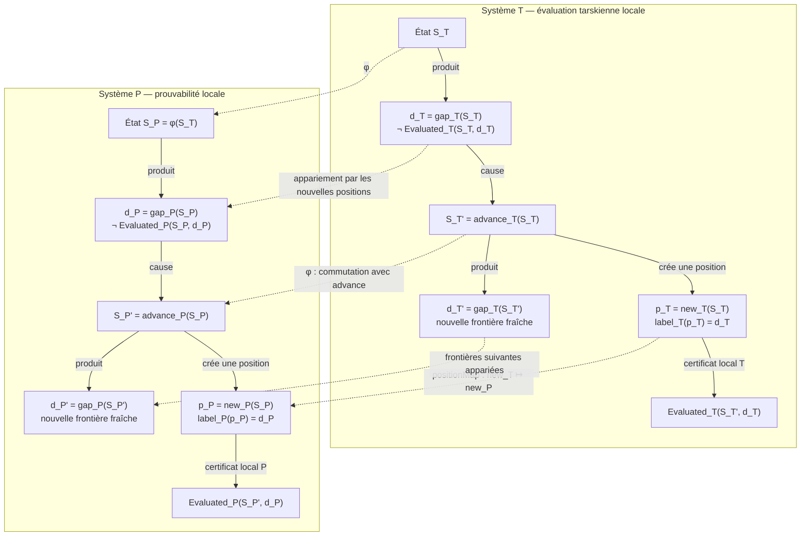
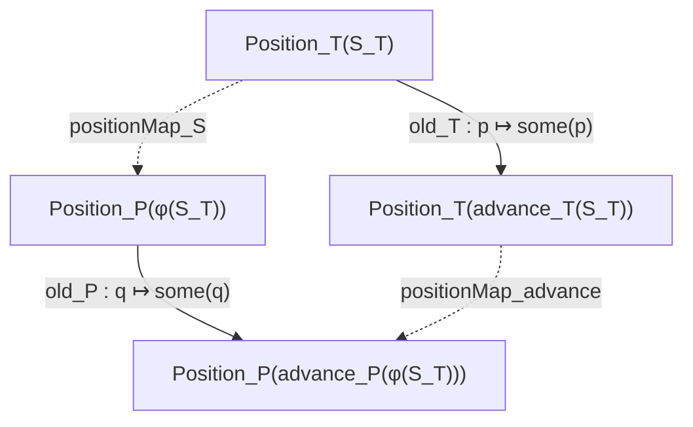

# Diagramme du morphisme causal médiatisé par le gap

Ce diagramme représente la cible formelle du morphisme entre la dynamique
tarskienne T et la progression de théories P. Les flèches verticales
transportent uniquement les états, les frontières syntaxiques et les
occurrences causales. Il n'existe aucune flèche verticale entre les deux
relations locales d'évaluation.

## Diagramme central



Les deux nœuds terminaux `Evaluated_T` et `Evaluated_P` ne sont volontairement
pas reliés. Le morphisme ne transforme ni une vérité en preuve, ni une preuve
en vérité. Il transporte le rôle causal du gap par lequel chaque système étend
son propre évaluateur local.

## Carré de conservation des occurrences



La commutation de ce carré exprime :

```text
positionMap_advance(old_T(p))
= old_P(positionMap_S(p)).
```

La nouvelle occurrence satisfait séparément :

```text
positionMap_advance(new_T(S_T))
= new_P(φ(S_T)).
```

Ces deux lois empêchent `positionMap` d'être une bijection arbitraire entre
deux mémoires de même cardinalité. Elles imposent la conservation de l'origine
causale de chaque événement.

## Factorisation positive de la mémoire

Dans chaque système, la mémoire propositionnelle est la projection d'un type
positif de positions :

```text
Memory(S, d)
↔ il existe p : Position(S), label(p) = d.
```

Un pas possède la décomposition exacte :

```text
Position(advance(S))
≃ Option(Position(S)).
```

La branche `none` est la nouvelle occurrence étiquetée par le gap courant. La
branche `some(p)` conserve une occurrence antérieure. Il en résulte :

```text
Memory(advance(S), d)
↔ d = gap(S) ∨ Memory(S, d).
```

La fermeture de l'ancien gap provient de sa nouvelle position et du certificat
local attaché à toute position :

```text
position_evaluated :
  Evaluated(S, label(p)).

newest_label :
  label(new(S)) = gap(S).

donc :
  Evaluated(advance(S), gap(S)).
```

## Lecture du diagramme

```text
Flèches horizontales
  gap → transformation de l'évaluateur → évaluation locale.

Flèches verticales
  transport de l'état, de la frontière et des occurrences causales.

Flèche verticale exclue
  Evaluated_T ↛ Evaluated_P.
```

Le contenu transporté est donc :

```text
frontière syntaxique ouverte
→ avance causée par le gap
→ nouvelle occurrence positive
→ évaluation locale de l'ancien gap
→ conservation de l'occurrence
→ nouvelle frontière fraîche.
```

## Statut formel

Le diagramme spécifie le théorème à construire. Les positions positives et
leur extension par `Option` existent déjà du côté T. Le type positif
`TheoryHistory.Contains` existe du côté P et fournit le support de
`Position_P`. L'interface positive commune, `φ`, `positionMap` et les preuves
de commutation restent à formaliser après fermeture constructive de la chaîne
arithmétique P.
