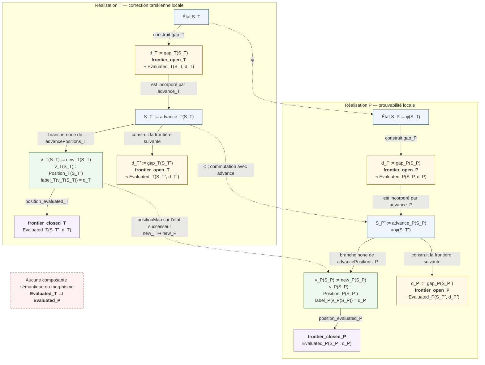
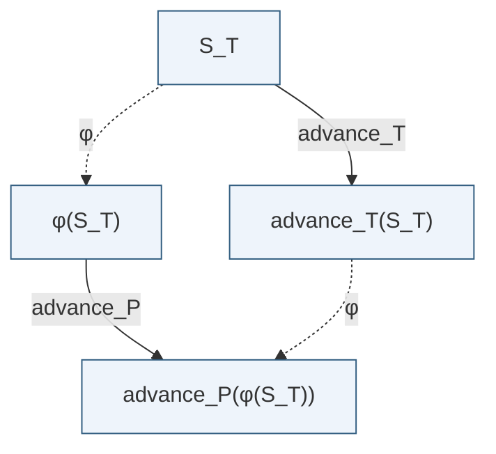
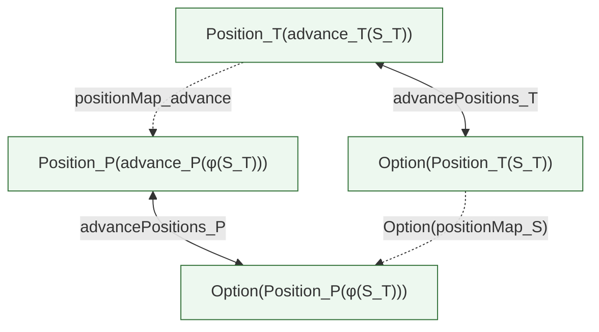
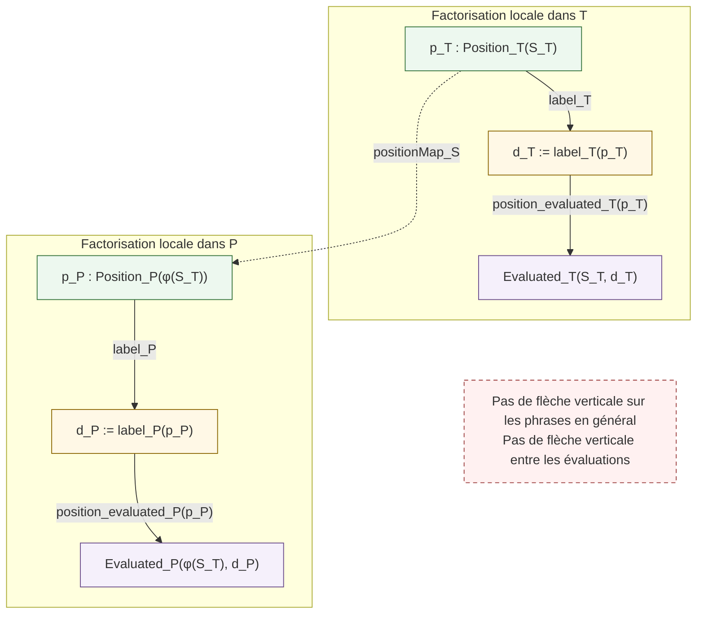

# Diagramme révisé du morphisme causal médiatisé par le gap

Ce document représente le morphisme entre la dynamique tarskienne `T` et la
progression de théories `P` en séparant strictement trois niveaux :

1. le **cycle local** propre à chaque système ;
2. le **transport causal** des états et des occurrences positives ;
3. les **évaluations terminales**, qui restent locales et ne sont pas
   transportées.

La correction principale par rapport au schéma initial est la suivante : les
gaps de `T` et de `P` ne sont pas reliés directement comme phrases. Leur
appariement est induit par le transport des **nouvelles occurrences** dont ils
sont les étiquettes.

## 1. Vue d’ensemble



### Lecture correcte de la verticale centrale

Le diagramme ne contient volontairement aucune flèche `d_T → d_P`. Les deux
frontières courantes sont appariées par le triangle de données suivant :

```text
label_T[S_T⁺](new_T(S_T)) = gap_T(S_T)

positionMap_{S_T⁺}(new_T(S_T)) = new_P(φ(S_T))

label_P[S_P⁺](new_P(φ(S_T))) = gap_P(φ(S_T)).
```

Ainsi, les gaps correspondent comme **événements frontières**. Ils ne sont ni
égaux comme phrases, ni reliés par une transformation syntaxique globale déjà
postulée. Les annotations `S_T⁺` et `S_P⁺` rappellent que les nouvelles
occurrences appartiennent aux états successeurs, tandis que les gaps qu'elles
étiquettent ont été construits aux états sources.

## 2. Carré de commutation des états



La commutation demandée est :

```text
φ(advance_T(S_T))
= advance_P(φ(S_T)).
```

Cette égalité transporte la succession des états. Elle ne compare pas leurs
contenus sémantiques.

## 3. Carré positif exact des occurrences

Le carré suivant remplace avantageusement le seul carré `old` du schéma
initial. Il exprime en une loi unique la compatibilité avec les deux branches
`none` et `some`.



La loi de commutation est :

```text
advancePositions_P ∘ positionMap_advance
=
Option(positionMap_S) ∘ advancePositions_T.
```

Elle produit immédiatement les deux équations fondamentales :

```text
positionMap_advance(new_T(S_T))
= new_P(φ(S_T))
```

et

```text
positionMap_advance(old_T(p))
= old_P(positionMap_S(p)).
```

Le transport préserve donc simultanément la **naissance** d’une occurrence et
son **héritage** dans les états futurs. Il ne s’agit pas d’une bijection choisie
après comparaison de deux cardinalités.

## 4. Factorisation locale par les positions



Pour une occurrence `p_T`, le morphisme induit seulement la correspondance
syntaxique dépendante de l’état et de l’occurrence :

```text
χ_{S_T}(p_T)
:= label_P(positionMap_{S_T}(p_T)).
```

Cette construction ne définit pas encore une fonction globale
`χ : Sentence → Sentence`, et elle ne transforme jamais un certificat
`Evaluated_T` en certificat `Evaluated_P`.

## 5. Mémoire exacte dérivée de la structure positive

Dans chaque réalisation :

```text
Memory⁺(S, d)
:⇔ ∃ p : Position(S), label(p) = d.
```

L’équivalence positive

```text
Position(advance(S)) ≃ Option(Position(S))
```

et les lois sur les étiquettes donnent :

```text
Memory⁺(advance(S), d)
↔ d = gap(S) ∨ Memory⁺(S, d).
```

La fermeture de l’ancien gap est elle aussi dérivée, et non ajoutée comme une
flèche sémantique entre les deux systèmes :

```text
new(S) : Position(advance(S))
label(new(S)) = gap(S)
position_evaluated(new(S))

────────────────────────────────
Evaluated(advance(S), gap(S)).
```

## 6. Cycle formel représenté

```text
frontier_open
→ gap syntaxique individué
→ advance qui incorpore ce gap
→ nouvelle occurrence positive
→ frontier_closed pour l’ancien gap
→ mémoire exacte et conservation des occurrences
→ conservation des évaluations déjà acquises
→ nouveau frontier_open dans l’état successeur.
```

Le morphisme transporte la colonne causale de ce cycle :

```text
état
+ succession par advance
+ nouvelle occurrence
+ anciennes occurrences héritées
+ provenance new / old
+ appariement événementiel des frontières.
```

Il ne transporte pas :

```text
Evaluated_T
models
CorrectAt
TheoryProvable
Evaluated_P.
```

## 7. Statut formel

Le diagramme spécifie la cible du théorème à construire. Les positions positives
et leur extension exacte par `Option` sont déjà disponibles du côté `T`. Le
type positif `TheoryHistory.Contains` fournit le support prévu de `Position_P`.
Les déclarations constituant la chaîne arithmétique `P` sont présentes dans les
sources, mais leur fermeture ne doit être annoncée qu'après compilation de la
cible terminale et audit axiomatique dans le même état du dépôt. À l'état relu
le 23 juillet 2026, cette recompilation reste à rétablir à partir de
`PrimitiveRecursiveProofCorrectness.lean`.

Indépendamment de ce point de certification, l'interface positive commune,
l'empaquetage des deux réalisations, `φ`, `positionMap` et leurs lois de
commutation restent à formaliser. Le diagramme ne les présente donc pas comme
des théorèmes déjà acquis.
