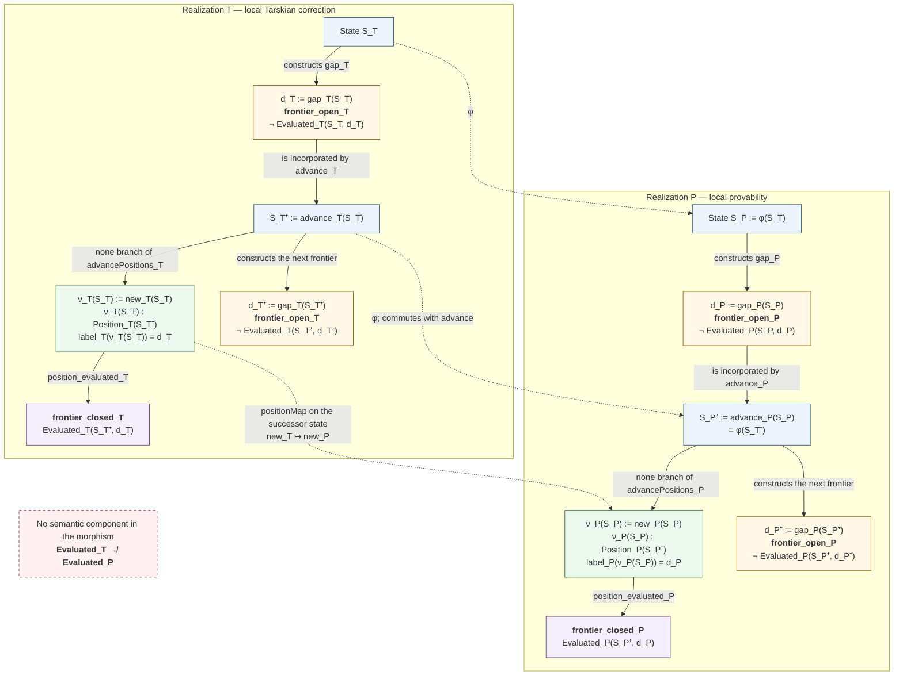
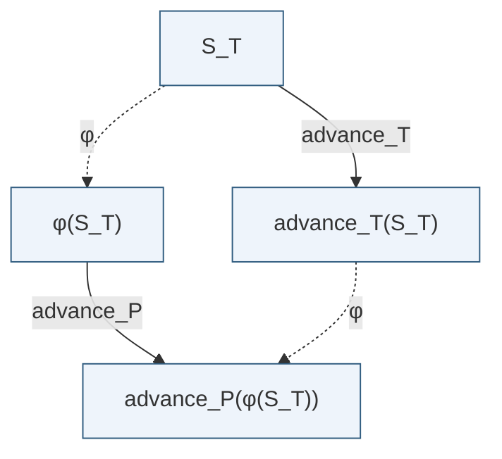
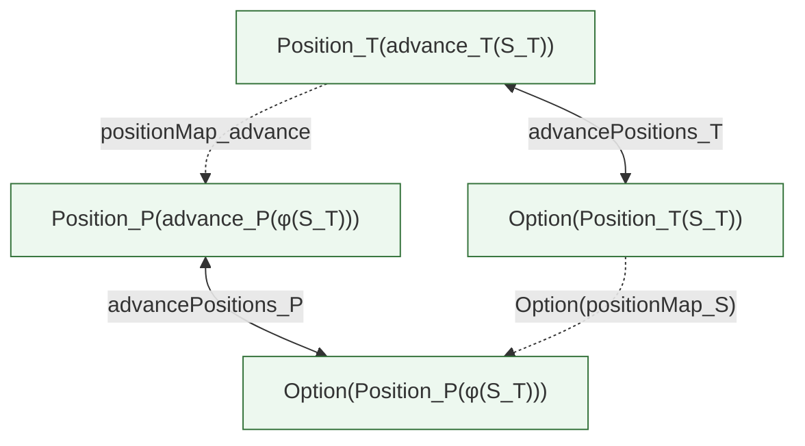
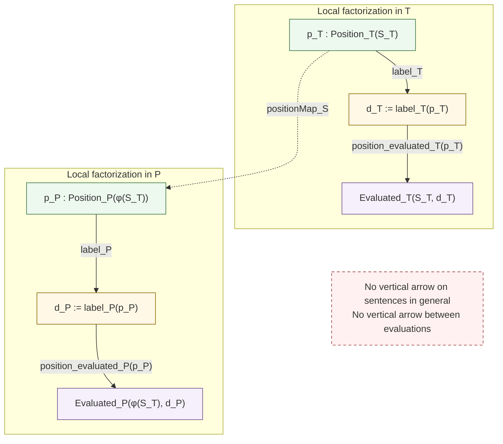

# Revised diagram of the gap-mediated causal morphism

This document represents the morphism between the Tarskian dynamics `T` and
the theory progression `P` while strictly separating three levels:

1. the **local cycle** proper to each system;
2. the **causal transport** of states and positive occurrences;
3. the **terminal evaluations**, which remain local and are not transported.

The main clarification with respect to the initial diagram is the following:
the gaps of `T` and `P` are not related directly as sentences. Their pairing is
induced by the transport of the **new occurrences** whose labels they are.

## 1. Overview



### Correct reading of the central vertical relation

The diagram deliberately contains no arrow `d_T → d_P`. The two current
frontiers are paired through the following triangle of data:

```text
label_T[S_T⁺](new_T(S_T)) = gap_T(S_T)

positionMap_{S_T⁺}(new_T(S_T)) = new_P(φ(S_T))

label_P[S_P⁺](new_P(φ(S_T))) = gap_P(φ(S_T)).
```

The gaps therefore correspond as **frontier events**. They are neither equal
as sentences nor related by an already postulated global syntactic
transformation. The annotations `S_T⁺` and `S_P⁺` recall that the new
occurrences belong to the successor states, whereas the gaps they label were
constructed at the source states.

## 2. State commutation square



The required commutation law is:

```text
φ(advance_T(S_T))
= advance_P(φ(S_T)).
```

This equality transports state succession. It does not compare the semantic
contents of the states.

## 3. Exact positive square of occurrences

The following square improves on the isolated `old` square of the initial
diagram. It expresses compatibility with both the `none` and `some` branches
in a single law.



The commutation law is:

```text
advancePositions_P ∘ positionMap_advance
=
Option(positionMap_S) ∘ advancePositions_T.
```

It immediately yields the two fundamental equations:

```text
positionMap_advance(new_T(S_T))
= new_P(φ(S_T))
```

and

```text
positionMap_advance(old_T(p))
= old_P(positionMap_S(p)).
```

The transport therefore preserves both the **birth** of an occurrence and its
**inheritance** in future states. It is not a bijection chosen after comparing
two cardinalities.

## 4. Local factorization through positions



For an occurrence `p_T`, the morphism induces only the syntactic
correspondence that depends on the state and occurrence:

```text
χ_{S_T}(p_T)
:= label_P(positionMap_{S_T}(p_T)).
```

This construction does not yet define a global function
`χ : Sentence → Sentence`, and it never transforms an `Evaluated_T`
certificate into an `Evaluated_P` certificate.

## 5. Exact memory derived from the positive structure

In each realization:

```text
Memory⁺(S, d)
:⇔ there exists p : Position(S), label(p) = d.
```

The positive equivalence

```text
Position(advance(S)) ≃ Option(Position(S))
```

together with the label laws gives:

```text
Memory⁺(advance(S), d)
↔ d = gap(S) ∨ Memory⁺(S, d).
```

Closure of the former gap is likewise derived, rather than added as a
semantic arrow between the two systems:

```text
new(S) : Position(advance(S))
label(new(S)) = gap(S)
position_evaluated(new(S))

────────────────────────────────
Evaluated(advance(S), gap(S)).
```

## 6. Formal cycle represented

```text
frontier_open
→ individuated syntactic gap
→ advance incorporating that gap
→ new positive occurrence
→ frontier_closed for the former gap
→ exact memory and preservation of occurrences
→ preservation of evaluations already acquired
→ new frontier_open in the successor state.
```

The morphism transports the causal column of this cycle:

```text
state
+ succession by advance
+ new occurrence
+ inherited former occurrences
+ new / old provenance
+ event-level pairing of frontiers.
```

It does not transport:

```text
Evaluated_T
models
CorrectAt
TheoryProvable
Evaluated_P.
```

## 7. Formal status

The diagram specifies the target theorem. Positive positions and their exact
extension by `Option` are already available on the `T` side. The positive type
`TheoryHistory.Contains` provides the intended support for `Position_P`.
Declarations making up the arithmetic `P` chain are present in the sources,
but their closure must be announced only after compilation of the terminal
target and an axiom audit in the same repository state. In the state reviewed
on 23 July 2026, that compilation still has to be restored starting from
`PrimitiveRecursiveProofCorrectness.lean`.

Independently of this certification point, the common positive interface,
packaging of both realizations, `φ`, `positionMap`, and their commutation laws
remain to be formalized. The diagram therefore does not present them as
theorems already established.
