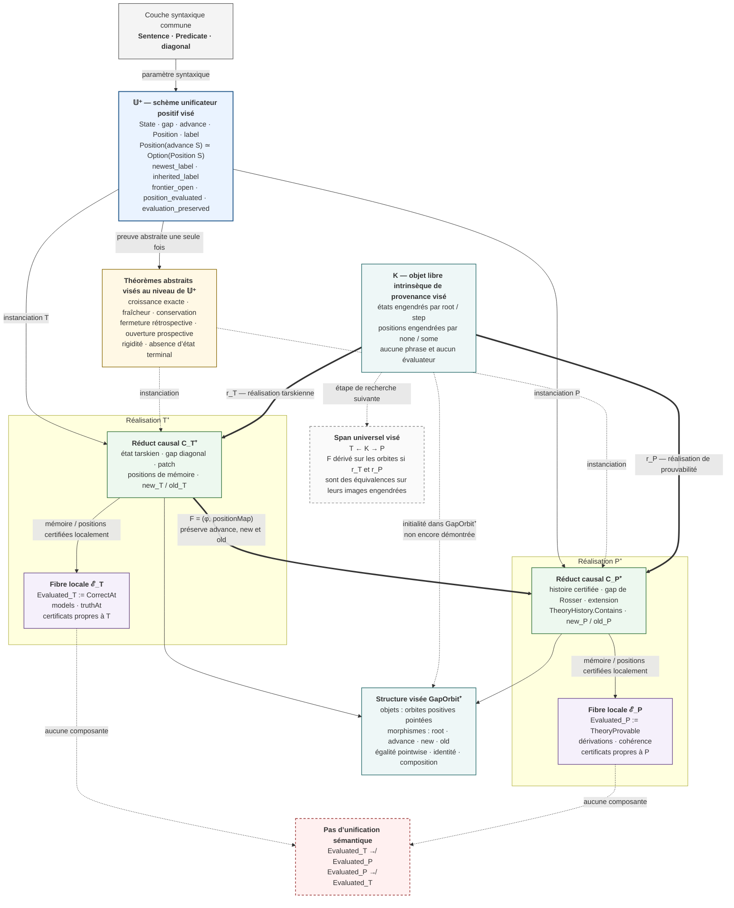
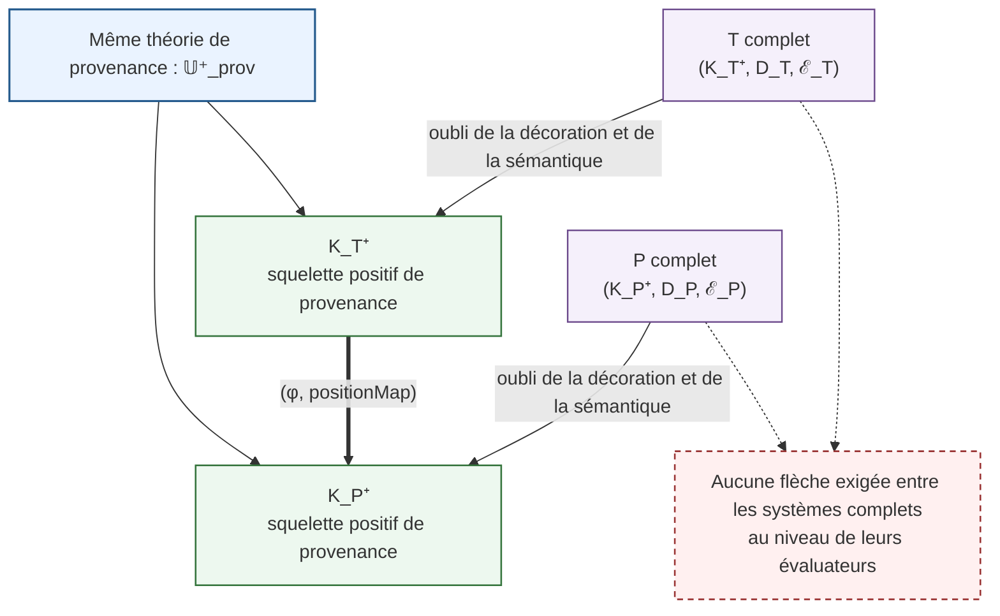
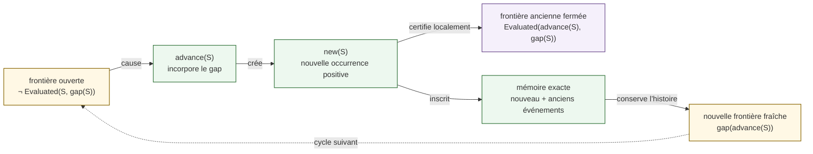

# Diagramme d’unification causale médiatisée par le gap

## 0. Sens exact de l’unification

L’unification visée n’est pas une identification de la vérité tarskienne avec
la prouvabilité. Elle possède trois composantes distinctes :

1. **unification de signature** : `T` et `P` réalisent la même interface positive ;
2. **unification de loi** : ils instancient le même cycle de transformation de
   frontière ;
3. **unification morphique** : leurs réducts causaux sont reliés par
   `(φ, positionMap)`.

Les évaluateurs restent des structures locales attachées à chaque réalisation.
Il n’existe donc aucune composante

```text
Evaluated_T → Evaluated_P
```

ni dans le sens inverse.

## 1. Vue d’ensemble : théorie commune, réalisations et morphisme



## 2. Décomposition formelle de l’interface unificatrice

Pour rendre visible ce que le morphisme transporte et ce qu’il ne transporte
pas, il faut distinguer trois structures dans une réalisation complète :

```text
R = (K_R⁺, D_R, ℰ_R)
```

où le **squelette positif de provenance** est

```text
K_R⁺ :=
  State_R
  root_R
  advance_R
  Position_R
  rootPositions_R :
    Position_R(root_R) ≃ Empty
  advancePositions_R :
    Position_R(advance_R(S)) ≃ Option(Position_R(S))
```

où la **décoration syntaxique locale** est

```text
D_R :=
  Gap_R
  gap_R
  label_R
  newest_label_R
  inherited_label_R
```

et où la **fibre d’évaluation locale** est

```text
ℰ_R :=
  Evaluated_R
  position_evaluated_R
  frontier_open_R
  evaluation_preserved_R.
```

`frontier_closed`, `memory_exact` et `memory_sound` se déduisent du squelette,
de la décoration et des certificats locaux.

Le morphisme universel agit d’abord sur les squelettes de provenance :

```text
F : K_T⁺ → K_P⁺
F := (φ, positionMap).
```

Il ne contient pas de fonction entre `ℰ_T` et `ℰ_P`. Il ne préserve pas non
plus les étiquettes par une égalité de phrases. Les décorations `D_T` et `D_P`
induisent seulement une correspondance dépendante entre les phrases portées
par deux occurrences appariées.

## 3. Carré de factorisation de l’unification



La formulation exacte est donc :

```text
T et P ne sont pas unifiés par une sémantique commune.
Leurs squelettes sont des modèles d’une même loi positive de provenance.
Leurs décorations syntaxiques et leurs évaluateurs restent locaux.
```

## 4. La loi commune de transformation des frontières

Le contenu véritablement unificateur est le cycle abstrait suivant :



`T` réalise ce cycle par diagonalisation et patch local. `P` le réalise par
phrase de Rosser et extension certifiée de théorie. La loi est commune ; les
mécanismes syntaxiques et les preuves locales restent différents.

## 5. Lois du morphisme unificateur

La composante d’état satisfait :

```text
φ(advance_T(S))
= advance_P(φ(S)).
```

La composante positive satisfait le carré exact :

```text
advancePositions_P ∘ positionMap_advance
=
Option(positionMap_S) ∘ advancePositions_T.
```

D’où :

```text
positionMap_advance(new_T(S))
= new_P(φ(S))
```

et

```text
positionMap_advance(old_T(p))
= old_P(positionMap_S(p)).
```

Les frontières sont alors appariées comme occurrences étiquetées :

```text
gap_T(S) = label_T[advance_T(S)](new_T(S))

gap_P(φ(S)) = label_P[advance_P(φ(S))](new_P(φ(S))).
```

Le morphisme transporte la place et la provenance de l’événement frontière,
mais ne postule ni égalité des deux phrases, ni fonction syntaxique globale
`Sentence → Sentence`. Les nouvelles occurrences étant portées par les états
successeurs, les indices `advance_T(S)` et `advance_P(φ(S))` font partie du
typage de ces deux égalités.

La structure visée `GapOrbit⁺` porte donc sur les squelettes de provenance.
Ses morphismes préservent `root`, la succession et les constructeurs
`new` / `old`. Ils ne préservent pas les étiquettes par une égalité dans
`Sentence`. Pour les réalisations décorées, la donnée induite par un morphisme
est seulement la correspondance dépendante

```text
χ_S(p)
:= label_P(positionMap_S(p)),
```

et non une loi `label_P(positionMap_S(p)) = label_T(p)`. Les étiquettes restent
ainsi une décoration syntaxique locale au-dessus de `GapOrbit⁺`.

## 6. Ce que l’architecture d’unification autorisera à affirmer

```text
Même interface constructive
+ même loi de renouvellement de frontière
+ transport des états et des occurrences
+ théorèmes causaux démontrés abstraitement
+ évaluateurs terminaux laissés séparés.
```

Une fois l’interface et le morphisme formalisés, on pourra donc dire :

> Deux mathématiques sont unifiées causalement lorsqu’elles sont des
> réalisations d’un même schème positif de transformation des frontières et
> qu’un morphisme en transporte les états, les occurrences et la provenance,
> sans identifier leurs évaluations locales.

## 7. Candidat universel précis

L’objet universel visé n’est ni une théorie commune, ni un évaluateur commun,
ni un quotient de `T` et `P`. C’est le squelette libre de leur provenance
causale.

Il doit être défini par une donnée inductive intrinsèque :

```text
KState :
  root
  step(previous)

KPosition(root)
  = Empty

KPosition(step(previous))
  ≃ Option(KPosition(previous)).
```

Cette définition peut être isomorphe à un temps fini, mais elle ne doit pas
être remplacée par un rang numérique externe. La récursion porte directement
sur les constructeurs `root` et `step`; les positions sont engendrées par
`none` et `some`.

`K` ne contient :

```text
ni Sentence ;
ni Predicate ;
ni gap syntaxique ;
ni models ;
ni TheoryProvable ;
ni Evaluated.
```

Il contient seulement ce qui peut réellement être commun et transporté :

```text
la racine ;
la succession ;
la naissance d’une occurrence ;
l’héritage des occurrences antérieures ;
leur provenance causale.
```

La propriété universelle candidate est l’initialité constructive de `K` dans
`GapOrbit⁺` :

> Pour toute orbite causale positive pointée `R`, il existe un unique morphisme
> de provenance `realize_R : K → K_R⁺` préservant `root`, `advance`, `new` et
> `old`.

L’existence et l’unicité doivent être prouvées par récursion et induction sur
`KState`. Elles ne requièrent aucune comparaison des étiquettes ni des
évaluateurs.

Dans une formalisation strictement constructive, « unique » ne doit pas être
encodé naïvement par l’égalité de deux fonctions. La formulation primaire est
pointwise :

```text
pour tout morphisme f : K → R,
pour tout état k : KState,
  f.stateMap(k) = realize_R.stateMap(k) ;

pour toute position p : KPosition(k),
  f.positionMap(p) = realize_R.positionMap(p),
après les transports dépendants explicitement nécessaires.
```

Les morphismes portent donc une relation d’équivalence extensionnelle
explicite, prouvée point par point. L’identité, la composition et l’universalité
sont établies relativement à cette relation, sans quotient, sans
`Quot.sound` et sans recours à `funext`. Si l’on réserve le mot « catégorie »
à une structure dont les hom-sets utilisent l’égalité native de Lean, il est
plus exact de parler d’abord d’une structure de morphismes enrichie par cette
équivalence pointwise.

Les deux systèmes fourniraient alors le span canonique :

```text
          K
        /   \
     r_T     r_P
      /       \
     T         P
```

Plus exactement, `r_T` et `r_P` visent les squelettes des orbites engendrées
de `T` et `P`. Si chacun est une équivalence sur son image engendrée, le
morphisme direct devient une construction dérivée :

```text
F : K_T⁺ → K_P⁺

F = r_P ∘ r_T⁻¹.
```

Cette formule ne doit pas être écrite sur tous les états bruts si les types
d’états contiennent des états inaccessibles depuis leur racine. L’inverse
`r_T⁻¹` n’est légitime que sur l’orbite engendrée, ou sur un sous-type portant
intrinsèquement son chemin depuis la racine.

Les décorations syntaxiques se replacent ensuite au-dessus du span :

```text
occurrence universelle k
→ label_T(r_T(k)) : Sentence

occurrence universelle k
→ label_P(r_P(k)) : Sentence.
```

Le même événement universel reçoit donc deux phrases locales, sans que celles-ci
soient égales. Enfin, chaque phrase entre dans son évaluateur local par les lois
propres à sa réalisation. C’est exactement ici que le gap permet l’évaluation
sans abolir la séparation entre syntaxe et sémantique.

Le résultat universel visé possède ainsi trois niveaux :

```text
K
= provenance causale universelle ;

D_T et D_P
= deux décorations syntaxiques locales de cette provenance ;

ℰ_T et ℰ_P
= deux évaluations locales, sans flèche sémantique entre elles.
```

L’initialité de `K` prise isolément est une construction libre standard. La
force du résultat viendrait de la preuve que les orbites tarskienne et de
Rosser se factorisent canoniquement par ce même objet, que leurs occurrences
sont transportées exactement, et que chaque décoration syntaxique médiatise
la fermeture locale de son propre évaluateur.

## 8. Statut formel et limite actuelle

Cette unification est actuellement une architecture mathématique précise, pas
encore un théorème Lean fermé. L’interface commune, `φ`, `positionMap`, leurs
lois de commutation, `GapOrbit⁺`, l’objet `K`, son initialité et les deux
réalisations `r_T`, `r_P` restent à formaliser.

Les déclarations constituant le côté `P` sont présentes dans les sources et le
plan les classe comme fermées. Cette qualification doit néanmoins rester
distincte d'une fermeture effectivement vérifiée dans l'état courant du dépôt :
elle exige la compilation de la cible terminale et son audit axiomatique. À
l'état relu le 23 juillet 2026, cette recompilation n'est pas rétablie, le
premier échec apparaissant dans
`PrimitiveRecursiveProofCorrectness.lean`. Le morphisme ne peut donc pas encore
être présenté comme construit sur deux réalisations dont la fermeture vient
d'être revalidée.

Le diagramme établit la **forme visée d’une unification structurelle** et
spécifie désormais la propriété universelle candidate. Il ne la démontre pas
encore. En particulier, ne sont actuellement établis ni :

```text
l’existence formelle de GapOrbit⁺ avec son équivalence pointwise ;
l’objet intrinsèque K dans cette catégorie ;
l’unicité de K → R pour toute orbite positive pointée R ;
les équivalences de K avec les deux orbites engendrées ;
la factorisation F = r_P ∘ r_T⁻¹.
```

À ce stade, la formulation rigoureuse est :

```text
candidat d’unification universelle
= objet libre intrinsèque de provenance
  + deux réalisations locales
  + morphisme causal dérivé sur les orbites engendrées ;

propriété universelle spécifiée,
mais pas encore démontrée.
```
