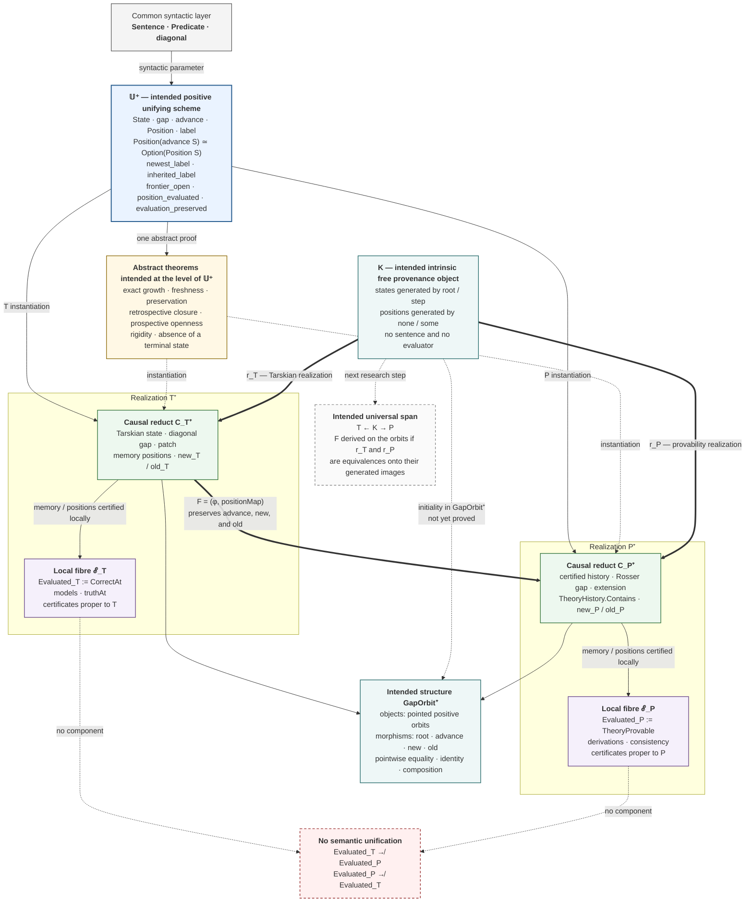
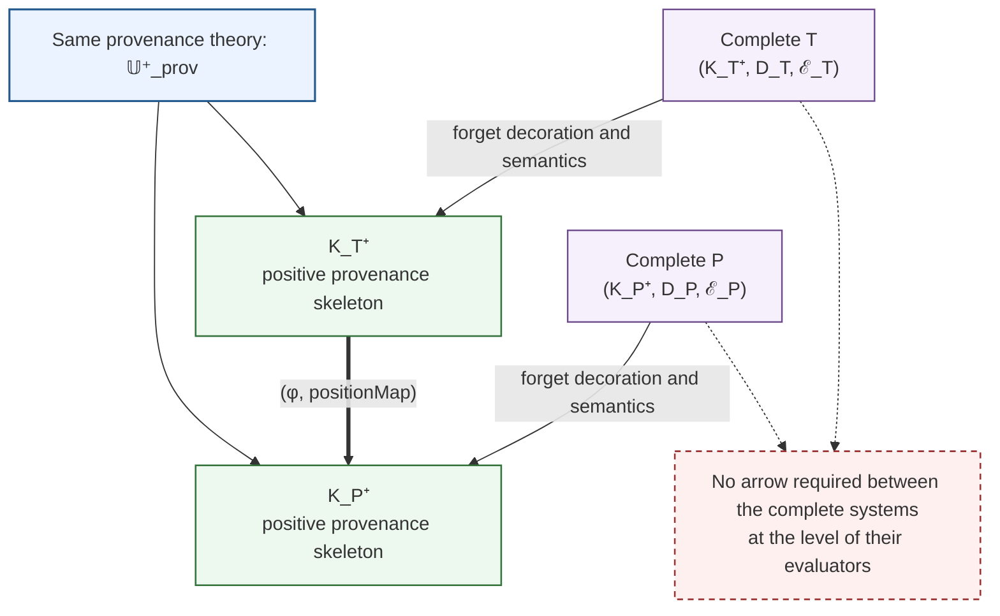
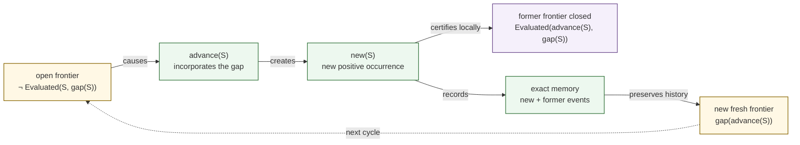

# Diagram of gap-mediated causal unification

## 0. Exact meaning of unification

The intended unification does not identify Tarskian truth with provability. It
has three distinct components:

1. **signature unification**: `T` and `P` realize the same positive interface;
2. **law unification**: they instantiate the same frontier-transformation
   cycle;
3. **morphic unification**: their causal reducts are related by
   `(φ, positionMap)`.

The evaluators remain local structures attached to each realization.
Consequently, there is no component

```text
Evaluated_T → Evaluated_P
```

nor one in the reverse direction.

## 1. Overview: common theory, realizations, and morphism



## 2. Formal decomposition of the unifying interface

To make visible what the morphism transports and what it does not transport,
three structures must be distinguished in a complete realization:

```text
R = (K_R⁺, D_R, ℰ_R)
```

where the **positive provenance skeleton** is

```text
K_R⁺ :=
  State_R
  root_R
  advance_R
  Position_R
  rootPositions_R :
    Position_R(root_R) ≃ Empty
  advancePositions_R :
    Position_R(advance_R(S)) ≃ Option(Position_R(S))
```

where the **local syntactic decoration** is

```text
D_R :=
  Gap_R
  gap_R
  label_R
  newest_label_R
  inherited_label_R
```

and the **local evaluation fibre** is

```text
ℰ_R :=
  Evaluated_R
  position_evaluated_R
  frontier_open_R
  evaluation_preserved_R.
```

`frontier_closed`, `memory_exact`, and `memory_sound` follow from the skeleton,
the decoration, and the local certificates.

The universal morphism first acts on the provenance skeletons:

```text
F : K_T⁺ → K_P⁺
F := (φ, positionMap).
```

It contains no function between `ℰ_T` and `ℰ_P`. Nor does it preserve labels
through equality of sentences. The decorations `D_T` and `D_P` induce only a
dependent correspondence between the sentences carried by two paired
occurrences.

## 3. Unification factorization square



The exact formulation is therefore:

```text
T and P are not unified by a common semantics.
Their skeletons are models of the same positive provenance law.
Their syntactic decorations and evaluators remain local.
```

## 4. The common law of frontier transformation

The genuinely unifying content is the following abstract cycle:



`T` realizes this cycle through diagonalization and local patching. `P`
realizes it through the Rosser sentence and certified theory extension. The
law is common; the syntactic mechanisms and local proofs remain different.

## 5. Laws of the unifying morphism

The state component satisfies:

```text
φ(advance_T(S))
= advance_P(φ(S)).
```

The positive component satisfies the exact square:

```text
advancePositions_P ∘ positionMap_advance
=
Option(positionMap_S) ∘ advancePositions_T.
```

Therefore:

```text
positionMap_advance(new_T(S))
= new_P(φ(S))
```

and

```text
positionMap_advance(old_T(p))
= old_P(positionMap_S(p)).
```

The frontiers are then paired as labelled occurrences:

```text
gap_T(S) = label_T[advance_T(S)](new_T(S))

gap_P(φ(S)) = label_P[advance_P(φ(S))](new_P(φ(S))).
```

The morphism transports the place and provenance of the frontier event, but
postulates neither equality of the two sentences nor a global syntactic
function `Sentence → Sentence`. Because new occurrences are carried by
successor states, the indices `advance_T(S)` and `advance_P(φ(S))` belong to
the typing of these two equalities.

The intended structure `GapOrbit⁺` therefore concerns provenance skeletons. Its
morphisms preserve `root`, succession, and the `new` / `old` constructors.
They do not preserve labels through an equality in `Sentence`. For decorated
realizations, the datum induced by a morphism is only the dependent
correspondence

```text
χ_S(p)
:= label_P(positionMap_S(p)),
```

not a law `label_P(positionMap_S(p)) = label_T(p)`. Labels therefore remain a
local syntactic decoration over `GapOrbit⁺`.

## 6. What the unification architecture will allow us to state

```text
Same constructive interface
+ same frontier-renewal law
+ transport of states and occurrences
+ causal theorems proved abstractly
+ terminal evaluators kept separate.
```

Once the interface and morphism have been formalized, one will therefore be
able to say:

> Two mathematics are causally unified when they are realizations of the same
> positive frontier-transformation scheme and a morphism transports their
> states, occurrences, and provenance, without identifying their local
> evaluations.

## 7. Precise universal candidate

The intended universal object is neither a common theory, nor a common
evaluator, nor a quotient of `T` and `P`. It is the free skeleton of their
causal provenance.

It must be defined through intrinsic inductive data:

```text
KState :
  root
  step(previous)

KPosition(root)
  = Empty

KPosition(step(previous))
  ≃ Option(KPosition(previous)).
```

This definition may be isomorphic to a finite time, but it must not be
replaced by an external numerical rank. Recursion acts directly on the
constructors `root` and `step`; positions are generated by `none` and `some`.

`K` contains:

```text
no Sentence;
no Predicate;
no syntactic gap;
no models;
no TheoryProvable;
no Evaluated.
```

It contains only what can genuinely be common and transported:

```text
the root;
succession;
the birth of an occurrence;
inheritance of previous occurrences;
their causal provenance.
```

The candidate universal property is constructive initiality of `K` in
`GapOrbit⁺`:

> For every pointed positive causal orbit `R`, there exists a unique
> provenance morphism `realize_R : K → K_R⁺` preserving `root`, `advance`,
> `new`, and `old`.

Existence and uniqueness must be proved by recursion and induction over
`KState`. They require no comparison of labels or evaluators.

In a strictly constructive formalization, “unique” must not be naively encoded
as equality of two functions. The primary formulation is pointwise:

```text
for every morphism f : K → R,
for every state k : KState,
  f.stateMap(k) = realize_R.stateMap(k);

for every position p : KPosition(k),
  f.positionMap(p) = realize_R.positionMap(p),
after the explicitly required dependent transports.
```

Morphisms therefore carry an explicit extensional equivalence relation proved
point by point. Identity, composition, and universality are established
relative to this relation, without a quotient, without `Quot.sound`, and
without `funext`. If the word “category” is reserved for a structure whose
hom-sets use Lean's native equality, it is more exact to first speak of a
morphism structure enriched with this pointwise equivalence.

The two systems would then supply the canonical span:

```text
          K
        /   \
     r_T     r_P
      /       \
     T         P
```

More exactly, `r_T` and `r_P` target the skeletons of the generated orbits of
`T` and `P`. If each is an equivalence onto its generated image, the direct
morphism becomes a derived construction:

```text
F : K_T⁺ → K_P⁺

F = r_P ∘ r_T⁻¹.
```

This formula must not be written on all raw states if the state types contain
states inaccessible from their roots. The inverse `r_T⁻¹` is legitimate only
on the generated orbit, or on a subtype intrinsically carrying its path from
the root.

The syntactic decorations are then placed back over the span:

```text
universal occurrence k
→ label_T(r_T(k)) : Sentence

universal occurrence k
→ label_P(r_P(k)) : Sentence.
```

The same universal event therefore receives two local sentences without those
sentences being equal. Finally, each sentence enters its local evaluator
through the laws proper to its realization. This is exactly where the gap
enables evaluation without abolishing the separation between syntax and
semantics.

The intended universal result therefore has three levels:

```text
K
= universal causal provenance;

D_T and D_P
= two local syntactic decorations of that provenance;

ℰ_T and ℰ_P
= two local evaluations, with no semantic arrow between them.
```

Initiality of `K` in isolation is a standard free construction. The strength
of the result would come from proving that the Tarskian and Rosser orbits
factor canonically through the same object, that their occurrences are
transported exactly, and that each syntactic decoration mediates the local
closure of its own evaluator.

## 8. Formal status and current limit

This unification is currently a precise mathematical architecture, not yet a
closed Lean theorem. The common interface, `φ`, `positionMap`, their
commutation laws, `GapOrbit⁺`, the object `K`, its initiality, and the two
realizations `r_T`, `r_P` remain to be formalized.

Declarations constituting the `P` side are present in the sources, and the
plan classifies them as closed. That classification must nevertheless remain
distinct from closure effectively verified in the current repository state:
it requires compilation of the terminal target and its axiom audit. In the
state reviewed on 23 July 2026, that compilation has not been restored, with
the first failure appearing in `PrimitiveRecursiveProofCorrectness.lean`.
Consequently, the morphism cannot yet be presented as constructed over two
realizations whose closure has just been revalidated.

The diagram establishes the **intended form of a structural unification** and
now specifies the candidate universal property. It does not yet prove it. In
particular, none of the following is currently established:

```text
the formal existence of GapOrbit⁺ with its pointwise equivalence;
the intrinsic object K in that category;
uniqueness of K → R for every pointed positive orbit R;
equivalences between K and the two generated orbits;
the factorization F = r_P ∘ r_T⁻¹.
```

At this stage, the rigorous formulation is:

```text
candidate universal unification
= intrinsic free provenance object
  + two local realizations
  + causal morphism derived on the generated orbits;

universal property specified,
but not yet proved.
```
